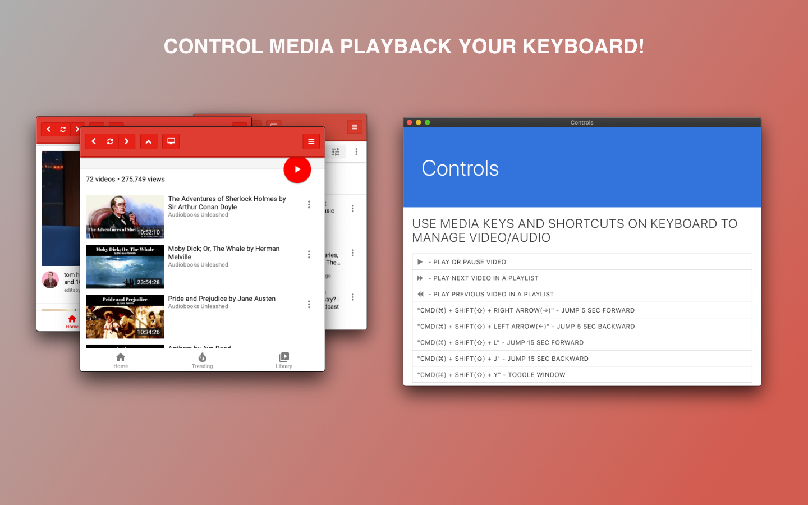

#  MenuTube for macOS


[Download](https://github.com/edanchenkov/MenuTube/releases) | [Website](http://menutube.rednuclearmonkey.com/) | [Red Nuclear Monkey](https://rednuclearmonkey.com/)




Do you enjoy listening to YouTube's podcasts, audiobooks, interviews or anything else that doesn't require to focus on video? If yes, then MenuTube is for you! Put entire full functional YouTube website into your macOs's menu bar.
 
 Features:
 - Browse mobile YouTube version
 - Watch or listen to bazillion hours of content
 - Control media playback using keys on your keyboard!
 - Intuitive and simple UI
 - And more

# Installation

[Download](https://github.com/edanchenkov/MenuTube/releases)

### Build macOS application (darwin)

```bash
npm i
npm run dist
```

#### Run dev

```bash
npm start
```
